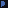

# px2svg

Convierte imágenes pixel art en SVG. En lugar de emitir un rectángulo por píxel,
une en un `<path>` cada bloque de píxeles contiguos del mismo color, trazando su
contorno mínimo (con sus agujeros).

Se puede usar de tres formas: **web**, **CLI** y **biblioteca**.

## Web

<https://jgermade.github.io/px2svg/> — la conversión ocurre entera en el
navegador (Rust compilado a WebAssembly), la imagen no se sube a ningún sitio.

## CLI

```
cargo build --release
./target/release/px2svg examples/sonic.png
```

Escribe `examples/sonic.svg` e informa de lo que ha hecho:

```
damero de transparencia #fefefe / #dadada, casilla 40.9x40.3 px: 16% a transparente
rejilla 80x126 (celda 20.45x20.36, offset 18.09,0.14)
43 colores, 385 paths, 1049 subtrazados -> examples/sonic.svg (30.2 KB)
```

| Opción | Descripción |
| --- | --- |
| `-o, --output <FICHERO>` | Salida (por defecto, la entrada con extensión `.svg`). |
| `-s, --scale <N>` | Tamaño de celda en píxeles reales. Por defecto se detecta; `1` desactiva la reducción. Admite decimales. |
| `--offset <X> <Y>` | Desplazamiento de la rejilla, si la detección falla. |
| `-t, --tolerance <N>` | Distancia máxima para fundir dos colores (por defecto `12`; `0` los conserva todos). |
| `-a, --alpha-threshold <N>` | Alfa mínimo para considerar visible un píxel (por defecto `128`). |
| `-p, --pixel-size <N>` | Tamaño de render de cada píxel, en unidades SVG. |
| `-b, --background <COLOR>` | Añade un rectángulo de fondo. |
| `-m, --merge-colors` | Un solo path por color, en vez de uno por bloque contiguo. |
| `-k, --keep-checkerboard` | No busca el damero de transparencia para quitarlo. |
| `-r, --remove-background` | Vacía el fondo liso y recorta el SVG al dibujo. |
| `-q, --quiet` | Silencia el informe. |

Formatos de entrada: PNG, JPEG, GIF, BMP y WebP.

## Biblioteca

```rust
let png = std::fs::read("sprite.png")?;
let out = px2svg::convert(&png, &px2svg::Config::default())?;
println!("{} colores en {} paths", out.colors, out.paths);
if let Some(damero) = out.checkerboard {
    println!("quitada la cuadrícula de {:.0} px", damero.cell.0);
}
std::fs::write("sprite.svg", out.svg)?;
```

`convert_rgba(width, height, &rgba, &config)` acepta píxeles ya decodificados,
que es la vía que usa la web. Las características de Cargo separan lo que
necesita cada consumidor:

| Característica | Qué añade |
| --- | --- |
| `cli` (por defecto) | El binario y los decodificadores de imagen. |
| `formats` | Sólo los decodificadores, para `convert`. |
| `wasm` | El enlace con JavaScript (`src/wasm.rs`). |

## Cómo funciona

1. **Cuadrícula de transparencia** ([`src/checker.rs`](src/checker.rs)). Al
   capturar la pantalla de un editor, el damero blanco/gris del fondo se queda
   pegado como píxeles opacos. Se buscan las parejas de grises más frecuentes y,
   de cada una, se mide si sus tiras de color miden todas lo mismo y arrancan en
   la misma fase; gana la que más imagen cubre. Sólo se borran las casillas que
   cuadran enteras **y cuyas vecinas alternan**: un plano blanco del dibujo —el
   ojo de un personaje— también encaja con las casillas claras, pero las suyas no
   alternan. Desde ahí el borrado se extiende por contigüidad.
2. **Detección de la rejilla** ([`src/grid.rs`](src/grid.rs)). El pixel art casi
   nunca llega a escala 1:1: un píxel del dibujo ocupa NxN píxeles reales. Los
   saltos de color caen entonces sobre una rejilla regular, así que el gradiente
   de la imagen es una señal periódica. Para cada periodo candidato se mide qué
   parte de la energía del gradiente se concentra en esa frecuencia y se elige el
   mayor periodo con buena puntuación (sus divisores describen la misma rejilla
   partida). La fase da el desplazamiento, y el periodo puede no ser entero, así
   que también funciona con imágenes reescaladas a un tamaño arbitrario.
3. **Reducción**. De cada celda se muestrea sólo su parte central —esquivando el
   antialiasing de los bordes— y se toma el color mayoritario.
4. **Paleta** ([`src/color.rs`](src/color.rs)). Los colores casi idénticos,
   típicos del ruido de compresión, se funden sobre el tono dominante.
5. **Fondo** ([`src/background.rs`](src/background.rs)), sólo con
   `--remove-background`. Se toma por fondo el color que domina el borde del
   lienzo y se vacía entrando desde fuera, de modo que ese mismo tono encerrado
   dentro del dibujo se conserva. Después el lienzo se recorta a lo que queda.
6. **Trazado** ([`src/trace.rs`](src/trace.rs)). Por cada color se recogen los
   lados que separan sus píxeles del resto, orientados de forma coherente, y se
   encadenan hasta cerrar bucles. Cada bucle es un subtrazado; contornos y
   agujeros conviven en el mismo `<path>` gracias a `fill-rule="evenodd"`. Los
   vértices colineales se eliminan, de forma que una región rectangular acaba en
   cuatro puntos.

## Estructura del SVG

Cada bloque de píxeles contiguos es un `<path>`, y todos los bloques de un color
van dentro de un `<g fill="…">`:

```xml
<g fill="#000000">
  <path d="M29 31v1h-1v1h1v2h-1v-1h-1v7h1v2h1v1h1v-1h1v-1h1v-9h-1v-2z"/>
  <path d="M8 34v1h1v1h-1v5h1v2h1v1h1v-1h1v-5h-1v-1h-1v-3z"/>
</g>
```

Así cada figura del documento es una forma que se puede seleccionar y mover por
separado en un editor vectorial. Con `--merge-colors` se vuelve a un único path
por color, con todos sus bloques como subtrazados: ocupa entre un 20 y un 30%
menos, pero seleccionar una figura selecciona todo lo que comparte su color.

Los bloques se agrupan por vecindad de 8, de forma que una diagonal de píxeles
—omnipresente en pixel art— es una sola figura y no una ristra de cuadraditos.

El `viewBox` va en píxeles del dibujo (1 unidad = 1 píxel), y `width`/`height`
reproducen el tamaño original de la imagen.

## Desarrollo

```
cargo test
cargo build --release                     # CLI en target/release/px2svg
wasm-pack build --release --target web \
  --out-dir docs/pkg --out-name px2svg \
  -- --no-default-features --features wasm # paquete web en docs/pkg
```

Para probar la web en local basta con servir `docs/` una vez compilado el wasm:

```
python3 -m http.server 8765 --directory docs
```

`.github/workflows/pages.yml` pasa los tests, compila el wasm y publica `docs/`
en cada push a `main`. Requiere activar Pages en el repositorio con
**Settings → Pages → Source: GitHub Actions**.

Lo que se publica es `docs/` y nada más: el wasm, la página y el logotipo. Las
imágenes de `examples/` se quedan fuera, así que la web no arrastra megas de
PNG ni de demostración.

Si una imagen sale mal, casi siempre es la rejilla: comprueba la celda que
informa el programa y fíjala a mano con `--scale`. Y si el damero de
transparencia se te lleva algo por delante, `--keep-checkerboard` lo desactiva.
